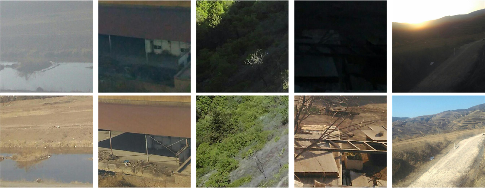

# Fixed-Camera-Outdoor-Scene-dataset-FCOS

  

We present the Fixed Camera Outdoor Scenes (FCOS) dataset, a comprehensive collection of desensitized transmission line imagery captured in diverse outdoor environments. Designed to address the challenges posed by complex background clutter in transmission line images and the absence of publicly available benchmark datasets, FCOS is specifically curated to facilitate the development and evaluation of domain-specific models. The dataset consists of 1,000 image pairs, partitioned into a training set of 700 pairs and a test set of 300 pairs.

At present, a subset of the test set has been made publicly accessible. The complete dataset will be released upon acceptance of the associated research paper, thereby providing broader support to the academic and technical community.
