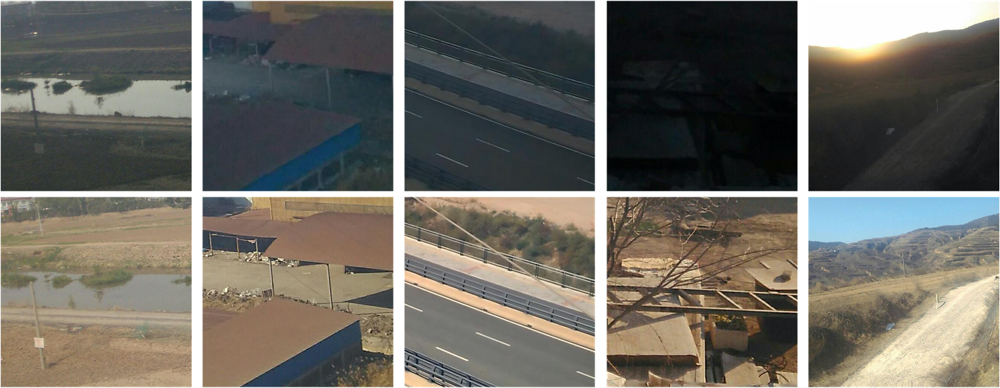

<div align="center">

# FCOS: Fixed-Camera Outdoor Scenes Dataset

**A paired real-world dataset for low-light image enhancement in fixed-camera outdoor scenes**


</div>

## Overview

FCOS is a paired image dataset collected from fixed cameras in diverse outdoor transmission-line environments. It is designed to support the development and evaluation of low-light image enhancement methods for domain-specific, real-world scenes. Privacy-sensitive visual content is de-identified before release.

The complete dataset contains **1,000 image pairs**, divided into **700 training pairs** and **300 test pairs**. This repository currently provides a representative preview subset. The complete dataset will be released after acceptance of the associated paper.

<div align="center">
  
  <p><em>Representative scenes from the FCOS dataset.</em></p>
</div>

## Dataset at a Glance

| Item | Description |
|---|---|
| Task | Low-light image enhancement |
| Full dataset size | 1,000 image pairs |
| Training set | 700 pairs |
| Test set | 300 pairs |
| Current public preview | 25 test pairs |
| Preview image size | 512 × 512 pixels |
| Full release | After acceptance of the associated paper |

## Dataset Structure

The complete release will use the following structure:

```text
FCOS/
├── train/
│   ├── gt/          # Ground-truth images
│   └── lq/          # Low-quality images
└── test/
    ├── gt/          # Ground-truth images
    └── lq/          # Low-quality images
```

The public preview currently available in this repository is organized as:

```text
test_demo/
├── gt_demo/         # Ground-truth preview images
└── lq_demo/         # Low-quality preview images
```

## Data Availability

This repository currently provides **25 representative test pairs** for qualitative inspection and pipeline validation. The preview subset is not intended to replace evaluation on the complete test set. The complete FCOS training and test sets will be released after acceptance of the associated paper.

## Release Plan

- [x] Public preview subset
- [ ] Complete training and test sets

## Citation

Citation information will be added after acceptance of the associated paper.
